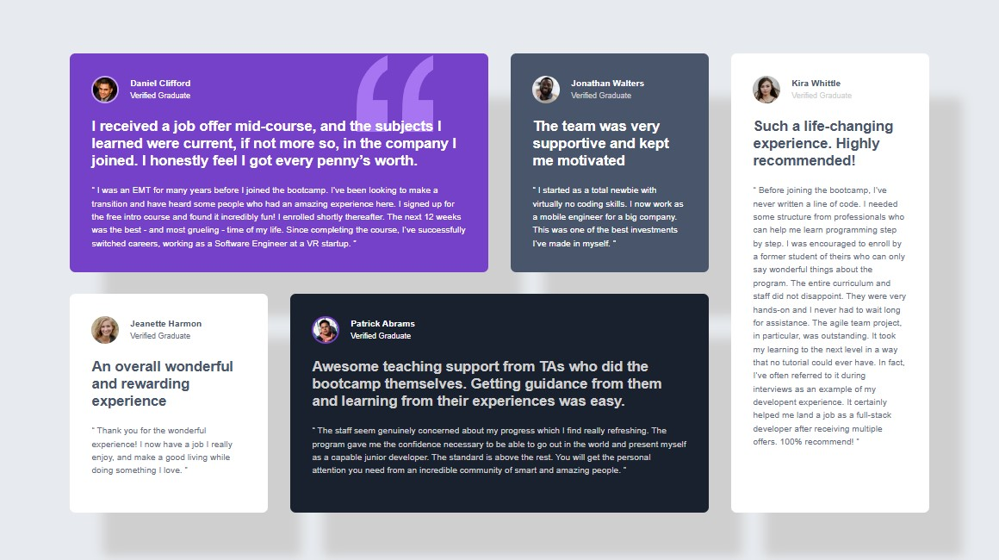

# Projeto Testimonials Grid Section (Frontend Mentor)

Versão Original

Minha Versão

## Tudo Bem ? 👋

Brigado por olha meu código isso me ajuda muito a ter um bom retorno em meus projetos.

Esses projetos que estou fazendo estão todos no site da [Frontend Mentor](https://www.frontendmentor.io) se você gosta dessa área, eu recomendo muito você visitar o site deles, por causa do conteudo e do ensino que eles transmitem, eu estou aqui hoje mostrando para vocês o que eu aprendir.

A também projetos meus que foram desenvolvidos com ensino do curso do [Dev em Dobro](https://www.instagram.com/devemdobro/) os quais eu recomendo muito, pois sem o curso deles eu não saberia por onde começar.

Sou muito grato a eles. 💻

## Sobre o Projeto

O projeto proposto foi fazer está página que infoma comentários e opniões de clientes de um serviço.

O objetivo do projeto (exercício) é melhorar e aprimorar o conhecimento em **`grid`** utilizando ela para fazer as colunas e linhas do projeto.

A principal missão era fazer o mais parecido possivel do que foi dado de referência.
Utilizei o**`Flex`** na vesão mobile, já que eu acho que funciona de uma forma melhor pra mim, no entanto sei que com o **`grid`** os elementos estariam parecidos ou iguais ao resultado final.

## Tecnologias Utilizadas

- HTML

- CSS

## Tranquilo ? 🤯

Este trabalho foi um desafio para mim, já que eu pouco tinha utilizado o **`grid`** durante meus projetos, mas graças a este exercício eu finalmente conseguir trabalhar com ele, além disso eu já estava querendo utilizar o **`grid`** a um bom tempo, pois o **`flex`** que eu utilizo bastante estava começando a me incomodar.

Durante a resolução eu estava tendo problemas em alinhar as linhas do **`grid`**, no entanto eu conseguir fazer com que fica se responsivo.
Demorei um pouco para enteder algumas coisas do **`grid`** mas consegui resolver em pouco tempo.

## Feedback 
Eu gosto muito de ouvir e ler opniões que me ajudam a aprender e evoluir, então se você estiver algo para falar sobre, me envie por um desses links :

📱 : [**Instagram**](https://www.instagram.com/arthurcastro_99/)

💻 : [**Linkedin**](https://www.linkedin.com/in/arthur-castro-b70a02223/)
